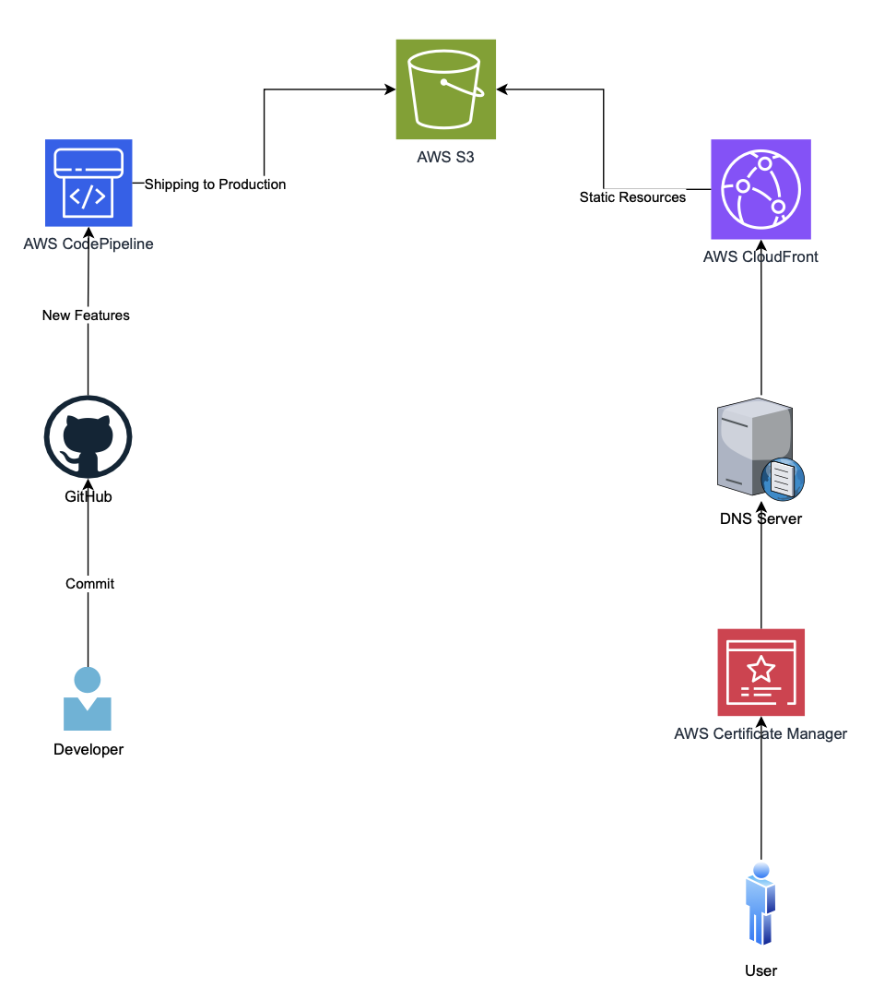

# AWS Static Website Hosting With CICD

This repository contains instructions for setting up a static website on AWS with Continuous Integration and Continuous Deployment (CICD) using AWS services like S3, CloudFront, ACM, Route 53, and CodePipeline. 

## Prerequisites

Before starting, make sure you have:

- An AWS account
- Basic knowledge of AWS services
- Your website files ready to be deployed

## Architecture Diagram

## Walkthrough

### Step 1: Set Up S3 Bucket

1. Create an S3 bucket to store your website files.
2. Upload your `index.html`, `styles.css`, and `index.js` files to the S3 bucket.
3. Enable static website hosting on the S3 bucket and configure the index document.

### Step 2: Configure CloudFront Distribution

1. Create a CloudFront distribution.
2. Set the S3 bucket as the origin for the CloudFront distribution.
3. Configure alternate domain names (CNAMEs) and SSL certificate using ACM.
4. Update DNS settings in Route 53 or your DNS provider to point to the CloudFront distribution.

### Step 3: Implement CodePipeline for CICD

1. Set up a CodePipeline.
2. Connect the pipeline to your GitHub repository where your website code resides.
3. Configure the pipeline to trigger on code changes in the repository.
4. Add stages to the pipeline for source, build, and deploy.
5. In the deploy stage, use AWS CodeDeploy to push changes to the S3 bucket.

### Step 4: Testing and Deployment

1. Make changes to your website code and commit them to your GitHub repository.
2. Observe the pipeline automatically triggering, building, and deploying changes to your website.
3. Test your website to ensure changes are reflected accurately.

## Conclusion

By following this walkthrough, you have set up a scalable and reliable static website hosting infrastructure on AWS. Additionally, you have implemented CICD practices, enabling automatic deployment of changes to your website, streamlining the development process and ensuring continuous delivery of updates to your users. This setup provides a robust foundation for hosting and managing static websites on AWS.
